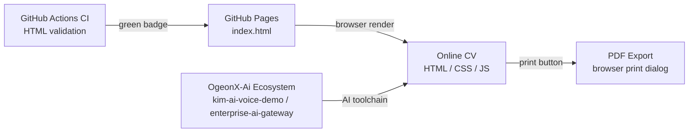

# My-CV

Kim Harjamaki's online CV -- an AI-augmented career portfolio maintained via the OgeonX-Ai automation ecosystem, covering 20+ years in Azure architecture, DevOps, and applied AI engineering.

    

Part of the Coding-Autopilot-System ecosystem: [gsd-orchestrator](https://github.com/Coding-Autopilot-System/gsd-orchestrator) | [Promptimprover](https://github.com/Coding-Autopilot-System/Promptimprover) | [autogen](https://github.com/Coding-Autopilot-System/autogen)

**See also:** [OgeonX-Ai/kim-ai-voice-demo](https://github.com/OgeonX-Ai/kim-ai-voice-demo) -- AI voice engineering platform

## Architecture

This CV is a single-page HTML/CSS/JavaScript document hosted on GitHub Pages. It is built and maintained using an AI-powered toolchain: LLM-based content triage determines section updates, Azure OpenAI assists with professional writing, GitHub Actions agents automate validation, and AI-driven documentation pipelines keep the portfolio consistent across all OgeonX-Ai repositories. The CV itself documents the AI engineering skills that power this workflow.

## Skills Covered

- AI and Automation: Azure OpenAI provisioning, prompt engineering for DevOps copilots, LLM-based incident triage, FastAPI backends for AI workflows, GitHub Actions automation agents, Gemini and Azure AI Studio integration, AI-driven documentation pipelines
- Azure Architecture: AZ-900, AZ-104, AZ-305 certified; Azure Landing Zones, Bicep IaC, Azure DevOps pipelines, Entra ID, Azure Monitor
- DevOps and Infrastructure: Kubernetes, Docker, Terraform, GitHub Actions, CI/CD pipeline design, self-hosted runners, infrastructure automation
- Development: C#/.NET, Python, JavaScript/TypeScript, PowerShell, Bash, REST APIs, FastAPI, Node.js

## View Online

[https://ogeonx-ai.github.io/My-CV/](https://ogeonx-ai.github.io/My-CV/)

The CV includes a print/PDF export button for offline use.

---

Part of the [Coding-Autopilot-System](https://github.com/Coding-Autopilot-System) ecosystem.
